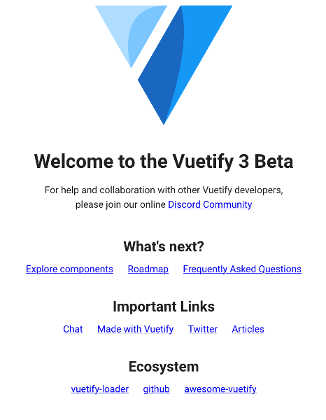

## Tutorial Set

Hi and welcome to the tutorial set on how to build an IVDA app. Together, we will build an exemplary webapp in 10 steps using Vue.Js and Python where you will learn the foundations of the involved technologies and their interplay.
Each tutorial set is further accompanied by references where the concepts needed are explained in more detail.
The time required for each step is not linear — while steps 0-8 are relatively straightforward, step 9 and 10 are more complex and will require additional time and focus. Plan accordingly.

**You should be able to clone the repository without developer access. Cloning it, and then working on your local machine is the easiest way to complete A1.** You're encouraged to start your own repository to keep track of your progress, but this is not a requirement.

We’ve included instructions with commands for both Unix and Windows environments to set up the project. In case you’re missing any Windows-specific commands or need further clarification, you can refer to resources like [this guide on Unix to Windows command equivalents](https://ioam.github.io/topographica/Downloads/win32notes.html) or [this command comparison sheet](https://gist.github.com/carlessanagustin/266171818584b3880f72a625dfa2513b).

### Tutorial-0: Frontend Boilerplate Code

#### Install Vue.js and create a Project
In the first couple of steps, we will install vue.js and create a basic boilerplate project. This web framework was chosen because it is one of the easiest to learn but still has all the functionalities of a modern web framework.

1. Install npm and node through the node.js website. Install the recommended version.
- check in terminal/cmd that the node version > 16.15: ``node -v``
- check npm version >= 9.8.0: ``npm -v``
2. Create an empty folder with the name “example-project”.
3. Open the empty folder in the command line / terminal.
4. (sudo) ``npm install -g @vue/cli`` (you can ignore the depreciation warning for now or use ``npm install --location=global @vue/cli``)
5. Within your folder, create a Vue project with “vue create hello-world” using the command line.  This creates a new directory with the specified project name inside the directory you defined.
6. Select Vue 3 with arrows + enter

7. Open the folder "hello-world" inside "example-project" in preferably Webstorm (free for students with educational package) or alternatively using visual studio code.
- For Webstorm, it's your best option to download the jetbrains toolbox
- For VS Code, install a vue extension if the vue syntax is not recognized (e.g. Vue 3 Snippets by hollowtree)
8. Open a terminal inside Webstorm and run: ``npm install``
9. Then, run in the same terminal ``npm run serve`` and navigate to localhost (highlighted link in the terminal).
   Congrats! Your first Vue.js App is running!

Screenshot

#### Install the Vuetify Library
In the next couple of steps we will add the Vuetify library to our project. This will help us with the styling and layout of the webapp.
1. Inside the terminal of the IDE, terminate the Frontend with "ctrl + c".
2. Add the Vuetify library with ``vue add vuetify`` (ignore any git related warning and proceed)
3. Use the Default option (Vuetify for Vue 3) and press enter.

4. Run ``npm run serve`` inside the IDE terminal and your project with vuetify should build. Then, navigate to localhost.

Screenshot

#### References
[Install Webstorm](https://www.jetbrains.com/help/webstorm/installation-guide.html)\
[Vue.JS 3 Tutorial (Youtube Playlist)](https://www.youtube.com/watch?v=YrxBCBibVo0)\
[Vuetify Tutorial (Youtube Playlist) #1 - #3](https://www.youtube.com/watch?v=2uZYKcKHgU0&list=PL4cUxeGkcC9g0MQZfHwKcuB0Yswgb3gA5)
