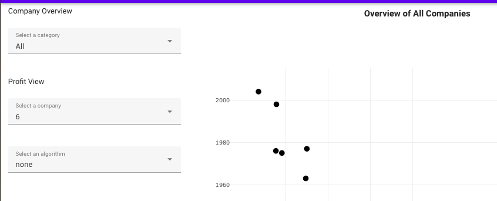

### Tutorial-9: Add Functionality and Design
This part is less guided than the tutorials before. It is meant for you to further work on the code and enhance the app functionalities. 

#### Basic adjustments
1. Change the header "Example Project" to your name and student number.
2. Your Configuration Panel should look similar to this at the moment:  
Make a decision on the design that visually highlights the configuration panel. 
3. Within the scatter plot the year axis is presented on the y-axis. In the line plot the year axis is presented on the x-axis. Choose the appropriate axis and make them consistent.
4. Add meaningful axis titles to the plots. 

#### Intermediate adjustments
1. Scatter plot: Differentiate the data points in the scatter plot by category (bank, tech, health) when "All" is selected in the categories. Use the same meaningful color code also for the individual categories. Shortly describe how you did it and where you changed which code. Add this to your submission pdf. 
2. Line plot: Adjust the plot in a way the predicted value (and the corresponding line) differs visually from the real values. Make sure this is only the case when the category 'random' or 'regression' is set.
3. Configuration Panel: Change the 'Select a company' data to allow users to select a company name, instead of its number.

#### Advanced adjustments
1. Check your project's data source and add one more plot to your application, based on the example code available here:  https://plotly.com/javascript/basic-charts/. Because of the limited data we provide in this tutorial, the functionality of your third plot might overlap with the existing ones.
   For example, you could show the employee number (company size) of a user-selected company, in comparison with the other companies in its category (The size of Apple compared to the average company size in Tech). 
2. Link your new plot with the Configuration Panel and the Scatter plot, meaning that when you select a company there, it shows the corresponding data in your new plot.
3. Make sure to also include meaningful titles, legends, and axis descriptions. 
4. Write a short paragraph on your decisions in the submission pdf - the specific instructions are included in the pdf. 

