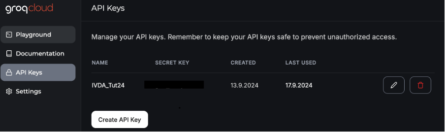
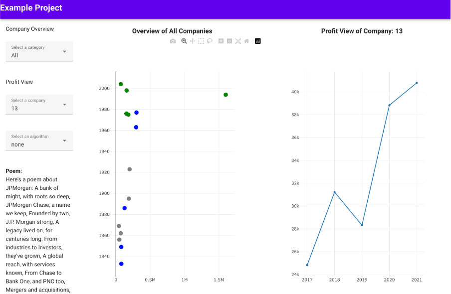

### Tutorial-10: LLM-API Integration
This last step is guided similarly to step 09. It is meant for you to further your understanding of the application's frontend-backend communication architecture, and enhance its functionalities. 

This step is worth 3 points in total: 
- You receive 1 point for setting up you Groq API integration (backend and frontend), plus displaying the examplar prompt.
- You receive 1 point for creating your own custom prompt and displaying it on the interface.
- You receive 1 point for stylizing these two prompts for better user-model collaboration.

More detailed instructions can be found below. 

Disclaimer: This tutorial was prepared on an Apple M1 system running macOS Sonoma 14.6.1. Please note that slight variations in setup and execution may exist if you are using a different operating system or hardware configuration. 

#### Register on Groq API and Generate Your API Key
1. Go to the [Groq API Registration](https://console.groq.com/).
2. Register an account and generate your API key.
3. **Important**: Save your API key for later. You will need it to make authenticated requests.




#### Backend Setup
Required Libraries
1. To make API calls in the backend, you need to install the following libraries: python-dotenv, requests, groq, json
2. Setting Up the .env File
   - In your backend folder, create a file named .env.
   - Add the following line to your .env file to store your API key:

```bash
    GROQ_API_KEY=your-api-key-here
```
3. Backend Code Example using the llama3-8b-8192 model
``` python
import os
import requests
import json
from dotenv import load_dotenv

# Load environment variables from .env
load_dotenv()
GROQ_API_KEY = os.getenv('GROQ_API_KEY')

class GroqClient:
    def __init__(self):
        self.api_key = GROQ_API_KEY
        self.base_url = "https://api.groq.com/v1"

    def generate_poem(self, company_name, prompt_file_path):
        url = f"{self.base_url}/chat/completions"
        headers = {
            "Authorization": f"Bearer {self.api_key}",
            "Content-Type": "application/json",
        }

        # Load prompt file
        with open(prompt_file_path, 'r') as file:
            messages_data = json.load(file)

        # Replace {company_name} in the prompt
        for message in messages_data["messages"]:
            message["content"] = message["content"].replace("{company_name}", company_name)

        # Make the API request
        response = requests.post(url, json={"model": "llama3-8b-8192", "messages": messages_data["messages"]}, headers=headers)
        
        if response.status_code == 200:
            return response.json()["choices"][0]["message"]["content"]
        else:
            return f"Error: {response.status_code}"
```

4. Example Code Structure
```bash
backend
├── src/
│  ├── llm/
│  │   ├── prompts/         # Folder for JSON prompt templates
│  │   │   ├── groq_api_poem.json  # JSON file containing the template for API calls
│  │   │   └── groq_api_additional_information.json      # Optional other prompt template for Groq API
│  │   ├── .env             # API key file (not included in the repository)
│  │   ├── groq_llm.py      # Python script containing logic for making API calls to Groq
│  │── __init__.py          # Initializes backend API for handling Groq API integration
│  │── model.py         
├── app.py                  # Main entry point of your Flask application
```

5. prompts/ folder usage:
- The JSON files in the prompts folder allow for dynamic content generation by using pre-defined structures. 
- For example, groq_api_poem.json might look like this using "company" as query parameter to customize the prompt:
```bash
{
    "messages": [
        {
            "role": "system",
            "content": "You are an AI that generates poems or provides information about companies."
        },
        {
            "role": "user",
            "content": "Please provide a poem or information about the company {company}."
        }
    ]
}
```

6. You still need to write an API endpoint which requests and returns a generated poem based on the selected company.


#### HTTP Request-Response Setup
1. Install axios to make HTTP requests in the frontend.
2. Read through this example code, which displays the poem in ConfigurationPanel.vue (frontend):
```javascript
    <!-- Display the poem -->
          <v-row v-if="poem">
            <v-col cols="12" sm="12">
              <div class="control-panel-font"><strong>Poem:</strong></div>
              <p>{{ poem }}</p>
            </v-col>
          </v-row>
        </v-col>
```
3. Read through this example code, which fetches the poem, or returns an error message (backend):
```javascript
async fetchPoem(companyId) {
      try {
        const response = await axios.get(`http://localhost:5000/llm/groq/poem/${companyId}`);
        this.poem = response.data.poem;
      } catch (error) {
        console.error("Error fetching the poem:", error);
      }
    }
```
Hint: Take a look at the response from the Groq API to see which field you need to use. In this case, the field is called "poem".
You can easily do this check by looking at the JSON at "http://localhost:5000/llm/groq/poem/1" using your browser, which should give you a poem for the company "alphabet". 

4. Make sure to adjust the rest of the frontend code so that the poem is displayed correctly in your application. Take a look at your error messages for hints on how to do so. 
5. It's up to you to decide when and where you want this new information, generated via the API, to be displayed. For example, you could display it after a user selects a point in the plot, or uses the company name dropdown.
   Below is an example of how a poem might be displayed within the Configuration Panel. This screenshot was prepared without the step 09 adjustments: 
   
6. Check which other database information might be useful for a user of your interface, and then use this information to create your own prompt for the Groq API. Use a minimum of 2 query parameters and save your new prompt in groq_api_additional_information.json. Then, display your result somewhere reasonable on your frontend.


#### Frontend Display of the Poem / Information
1. Highlight in the frontend which query parameters are used for all the Groq API calls. Aside: This is a great way to guide a user within your application. 


#### Submission
Please submit your work via OLAT. More information on how to do so is available in the pdf "Instructions Assignment 1: IVDA Tutorial 2024", found on the A1 submission page on OLAT.
Information on the point distribution can also be found in this document. 


